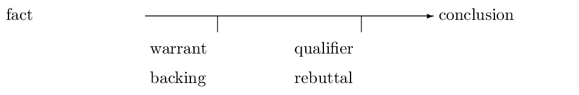
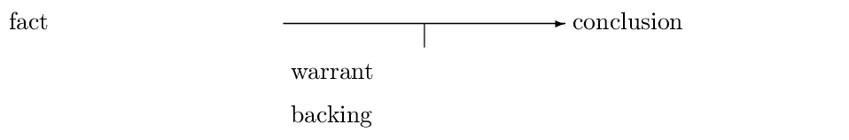

# argumentation.sty
LaTeX package for argumentation theory (Toulmin 1958 etc). The aim of developing this package is to provide an environment like the toulmin-environment to typeset argumentation schemes. E.g:
```latex
\documentclass{article}
\usepackage{argumentation}
\begin{document}

\begin{toulmin}
  \fact{fact}
  \warrant{warrant}
  \backing{backing}
  \qualifier{qualifier}
  \rebuttal{rebuttal}
  \conclusion{conclusion}
\end{toulmin}

\end{document}
```


If you are not using `\qualifier` and `\rebuttal`, the design is automatically
changed:

```latex
\begin{toulmin}
  \fact{fact}
  \warrant{warrant}
  \backing{backing}
  \conclusion{conclusion}
\end{toulmin}
```



I start deleloping with a regular tex-file. This will get transferred to a dtx file with documentation soon. It will *not* be stable until some time in 2020.

# references
Toulmin, S. E. (1958). _The uses of argument_. Cambridge: Cambridge University Press.
